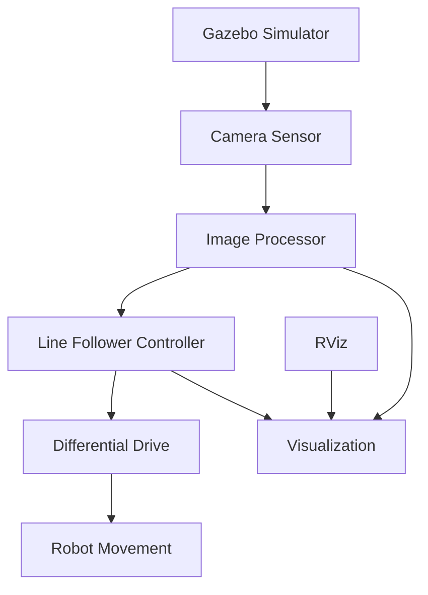

Now I'll create a comprehensive, elegant README.md file for this line maze solver project based on my analysis of the codebase:

# Line Maze Solver - ROS 2 Autonomous Robot


[Features](#features) -  [Installation](#installation) -  [Usage](#usage) -  [Architecture](#architecture) -  [Contributing](#contributing)


## 🌟 Overview

The **Line Maze Solver** is a sophisticated ROS 2 package that simulates an autonomous differential-drive robot capable of following lines and navigating through complex maze environments. Built with cutting-edge computer vision algorithms and optimized control systems, this project demonstrates practical applications of robotics, machine learning, and autonomous navigation.

## ✨ Features

### 🤖 **Autonomous Navigation**
- **Real-time Line Detection**: Advanced computer vision pipeline using OpenCV for robust line identification
- **PID Control System**: Optimized proportional-integral-derivative controller for smooth and precise movement
- **Adaptive Speed Control**: Dynamic velocity adjustment based on path complexity and navigation confidence

### 🎮 **Simulation Environment**
- **Gazebo Integration**: High-fidelity 3D physics simulation with realistic robot dynamics
- **Custom World Models**: Pre-designed maze environments with various complexity levels
- **RViz Visualization**: Real-time monitoring of robot state, sensor data, and navigation decisions

### 🔧 **Technical Excellence**
- **Modular Architecture**: Clean, maintainable code structure following ROS 2 best practices
- **Performance Optimization**: Efficient image processing with configurable quality settings
- **Comprehensive Launch System**: Easy-to-use launch files for different simulation scenarios

## 🚀 Quick Start

### Prerequisites

Ensure you have the following installed on your system:

- **ROS 2 Humble** (or compatible version)
- **Gazebo 11+**
- **Python 3.8+**
- **OpenCV 4.0+**

### Installation

1. **Clone the repository**
   ```bash
   cd ~/ros2_ws/src
   git clone https://github.com/rohitjangra7370/line_maze_solver.git
   ```

2. **Install dependencies**
   ```bash
   cd ~/ros2_ws
   rosdep install --from-paths src --ignore-src -r -y
   ```

3. **Build the workspace**
   ```bash
   colcon build --packages-select line_maze_solver
   source install/setup.bash
   ```

### Usage

#### 🎯 **Launch Complete Simulation**
```bash
ros2 launch line_maze_solver maze_bot_launch.py
```
This launches the complete system including Gazebo simulation, robot model, navigation nodes, and RViz visualization.

#### 🔧 **Individual Components**

**Gazebo Simulation Only:**
```bash
ros2 launch line_maze_solver gazebo_launch.py
```

**Line Follower Algorithm:**
```bash
ros2 launch line_maze_solver line_follower_launch.py
```

**RViz Visualization:**
```bash
ros2 launch line_maze_solver rviz_launch.py
```

## 🏗️ Architecture

### System Components



### 📁 **Project Structure**

```
line_maze_solver/
├── 📋 CMakeLists.txt          # Build configuration
├── 📋 package.xml             # Package dependencies
├── 📁 config/                 # Configuration files
│   └── default.rviz           # RViz setup
├── 📁 launch/                 # Launch files
│   ├── gazebo_launch.py       # Gazebo simulation
│   ├── line_follower_launch.py # Navigation algorithm
│   └── maze_bot_launch.py     # Complete system
├── 📁 models/                 # Custom Gazebo models
│   └── line_path_ground_plane/ # Line path environment
├── 📁 src/nodes/              # Core algorithms
│   ├── image_processor.py     # Computer vision pipeline
│   └── line_follower.py       # Navigation controller
├── 📁 urdf/                   # Robot description
│   ├── robot.urdf.xacro       # Main robot model
│   └── camera.xacro           # Camera configuration
└── 📁 worlds/                 # Simulation environments
    ├── line_follower.world    # Line following environment
    └── default.world          # Standard test world
```

### 🧠 **Algorithm Details**

#### **Computer Vision Pipeline**
- **Image Preprocessing**: Adaptive thresholding and morphological operations
- **Contour Detection**: Efficient line boundary identification
- **Centroid Calculation**: Precise line center computation for navigation reference

#### **Control System**
- **PID Controller**: Tuned parameters for optimal response
  - `Kp = 0.08` (Proportional gain)
  - `Ki = 0.003` (Integral gain) 
  - `Kd = 0.05` (Derivative gain)
- **Error Filtering**: Moving average filter for smooth control signals
- **Safety Mechanisms**: Automatic stopping on line loss detection

## ⚙️ Configuration

### **Tuning Parameters**

Key parameters can be adjusted in `src/nodes/line_follower.py`:

```python
# Control parameters
self.Kp = 0.08          # Proportional gain
self.Ki = 0.003         # Integral gain  
self.Kd = 0.05          # Derivative gain

# Performance settings
self.max_linear_speed = 1.0    # Maximum forward speed
self.max_angular_speed = 1.0   # Maximum turning speed
self.processing_width = 320    # Image processing resolution
```

### **Robot Specifications**

- **Type**: Differential drive robot
- **Dimensions**: 0.15m × 0.15m × 0.05m
- **Wheel Configuration**: Two drive wheels + castor wheel
- **Camera**: Forward-facing with 800×600 resolution
- **Sensors**: RGB camera for line detection

## 🤝 Contributing

We welcome contributions! Please follow these steps:

1. **Fork** the repository
2. **Create** a feature branch (`git checkout -b feature/amazing-feature`)
3. **Commit** your changes (`git commit -m 'Add amazing feature'`)
4. **Push** to the branch (`git push origin feature/amazing-feature`)
5. **Open** a Pull Request

### **Development Guidelines**
- Follow PEP 8 for Python code style
- Add comprehensive docstrings and comments
- Include unit tests for new functionality
- Update documentation for significant changes

## 📖 Documentation

- **ROS 2 Documentation**: [docs.ros.org](https://docs.ros.org)
- **Gazebo Tutorials**: [gazebosim.org](https://gazebosim.org)
- **OpenCV Reference**: [opencv.org](https://opencv.org)

## 🐛 Troubleshooting

### **Common Issues**

**Gazebo fails to launch:**
```bash
# Check Gazebo installation
gazebo --version
# Source the workspace
source ~/ros2_ws/install/setup.bash
```

**Camera not detecting lines:**
- Verify lighting conditions in simulation
- Check camera orientation and field of view
- Adjust HSV thresholds in `image_processor.py`

**Robot moving erratically:**
- Tune PID parameters in `line_follower.py`
- Check wheel joint configurations in URDF
- Verify ground friction settings

## 📄 License

This project is licensed under the **Apache License 2.0** - see the [LICENSE](LICENSE) file for details.

## 👨‍💻 Author

**Rohit Jangra**
- GitHub: [@rohitjangra7370](https://github.com/rohitjangra7370)
- Email: rohitjangra7370@gmail.com

## 🙏 Acknowledgments

- ROS 2 Community for excellent documentation and support
- Gazebo Team for the powerful simulation environment
- OpenCV Contributors for computer vision capabilities
- Open Source Robotics Foundation (OSRF)


**⭐ Star this repository if you find it helpful!**

*Built with ❤️ using ROS 2, Gazebo, and OpenCV*
